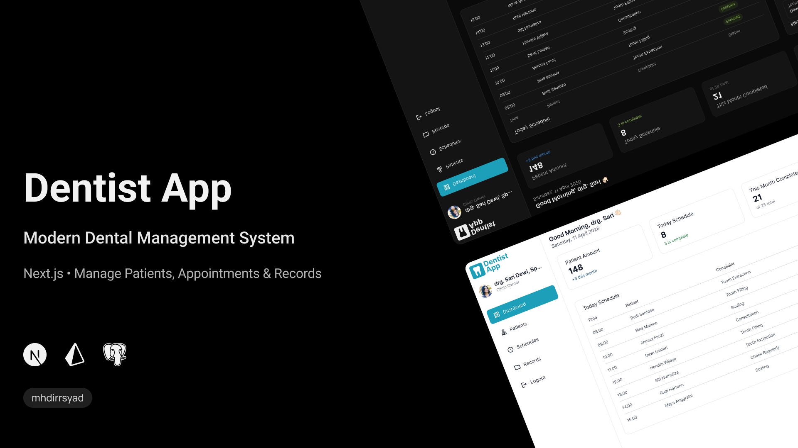

# Dentist App: Modern Dental Management System

A web-based dental clinic management system built with **Next.js** and **PostgreSQL**, designed to help dentists work more efficiently by managing patients, appointments, and medical records digitally.



---

## Features

- **Dashboard**: Real-time overview of today's appointments and patient statistics
- **Authentication**: Secure single-user login system
- **Patient Management**: Add, view, and update patient data
- **Schedule Management**: Create and manage appointment schedules
- **Medical Records**: Record and access patient history after each appointment

---

## Tech Stack

| Layer    | Technology        |
| -------- | ----------------- |
| Frontend | Next.js           |
| Styling  | Tailwind CSS      |
| Database | PostgreSQL (Neon) |
| ORM      | Prisma            |

---

## Getting Started

### Prerequisites

Make sure you have these installed:

- [Node.js](https://nodejs.org/) (v18+)

### Installation

1. **Clone the repository**

   ```bash
   git clone https://github.com/mhdirrsyad/dentist-app.git
   cd dentist-app
   ```

2. **Install dependencies**

   ```bash
   npm install
   ```

3. **Set up environment variables**

   Create a `.env` file in the root directory:

   ```env
   # 1. Get DATABASE_URL from your Neon dashboard (https://neon.tech)
   DATABASE_URL="postgresql://..."

   # 2. Generate AUTH_SECRET by running: npx auth secret
   AUTH_SECRET="your-secret-key"
   ```

4. **Run database migrations**

   ```bash
   npx prisma migrate dev
   ```

5. **Start the development server**

   ```bash
   npm run dev
   ```

6. Open [http://localhost:3000](http://localhost:3000) in your browser.

---

## Project Structure

```
dentist-app/
├── app/
│   ├── dashboard/        # Dashboard pages
│   ├── login/            # Login page
│   ├── ui/               # Reusable UI components
│   └── lib/              # Utility functions & DB client
├── prisma/               # Database schema, migrations, & seeder
├── public/               # Static assets
├── types/                # TypeScript type definitions
├── auth.ts               # Authentication config
├── next.config.ts        # Next.js config
└── prisma.config.ts      # Prisma config
```

---

## Planned Features

- Multi-user roles (Admin, Doctor, Staff)
- Patient notifications & reminders
- Export reports to PDF

---

## Author

**mhdirrsyad**
